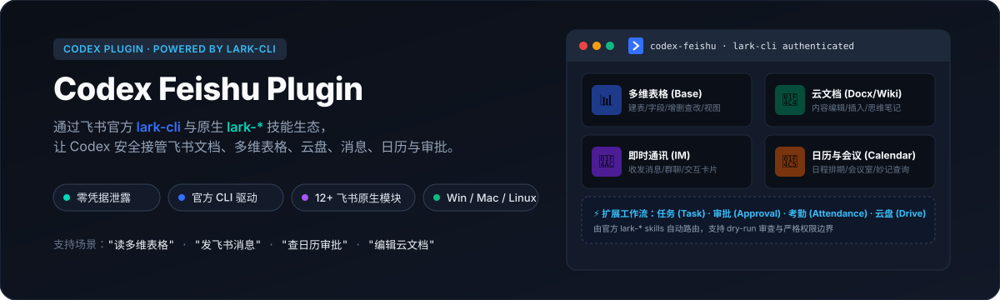
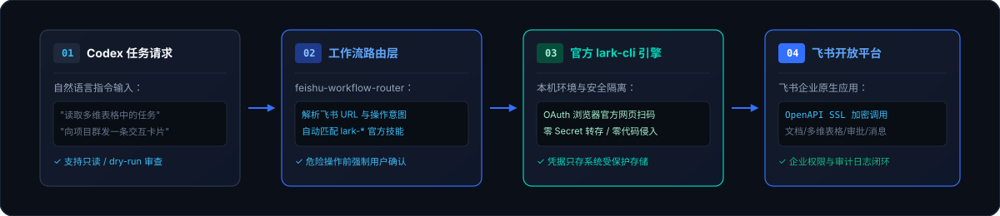

<p align="center">
  
</p>

<p align="center">
  <a href="https://github.com/larksuite/cli"></a>
  <a href="LICENSE"></a>
  <a href="#-支持平台与系统"></a>
  <a href="#-安全与信任边界"></a>
</p>

---

## 💡 一分钟看懂：它是什么？

**Codex Feishu Plugin** 是专为 [Codex](https://github.com/openai/codex) 设计的**飞书/Lark 企业级全场景工作流路由插件**。

以往让 AI 操作飞书往往需要开发者手写繁琐的 OpenAPI 胶水代码，还存在 App Secret 泄露到对话或环境中的高危风险。本项目通过桥接飞书官方开源的 [`lark-cli`](https://github.com/larksuite/cli) 及其底层完善的 `lark-*` Skills 生态，让 Codex **零凭据外泄、完全合规**地接管文档编辑、多维表格增删改查、即时群消息推送、日程预约及协同审批！

<p align="center">
  
</p>

---

## ⚡ 核心能力矩阵

插件通过内置的 `feishu-workflow-router` 智能识别用户意图与飞书资源链接，自动调度本机官方 `lark-*` Skills：

| 飞书业务模块 | 官方运行时 Skill | 支持的核心操作场景 |
| --- | --- | --- |
| 📊 **多维表格 (Base)** | `lark-base` | 自动建表、字段定义、批量增删改查记录、多视图过滤、仪表盘、公式计算 |
| 📄 **云文档 (Docx / Wiki)** | `lark-doc` / `lark-wiki` | Markdown 与文档双向转换、段落增改、思维笔记、知识库目录与节点管理 |
| 📁 **云空间 (Drive)** | `lark-drive` | 文件与文件夹上传/下载/移动/删除、元数据检索、权限配置与外链管理 |
| 💬 **即时消息 (IM)** | `lark-im` | 个人/群聊消息收发、富文本与互动卡片（Interactive Card）推送、群成员管理 |
| 📅 **日历与会议 (Calendar)** | `lark-calendar` / `lark-meeting` | 日程智能排期、忙闲检索、会议室预订、妙记/逐字稿提取与纪要提炼 |
| ✅ **任务与审批 (Task/Approval)** | `lark-task` / `lark-approval` | 待办任务清单、拆分子任务、发起原生审批单、查询待办与审批进度跟踪 |
| 🕒 **考勤打卡 (Attendance)** | `lark-attendance` | 个人出勤打卡记录查询与工时统计 |
| 🛠️ **妙搭与开放能力** | `lark-apps` / `lark-openapi-explorer` | 妙搭应用数据维护、探索调用官方 CLI 尚未封装的原生 OpenAPI 接口 |

---

## 🔒 安全与信任边界 (Zero Secrets)

本插件严格遵循**企业级最小权限与零凭据驻留**原则：

1. **绝对零 Secret 外泄**：插件本身与仓库代码**不存储、不中转、不记录任何 App ID 或 App Secret**；
2. **官方 OAuth 浏览器鉴权**：登录过程由官方 `lark-cli` 唤起浏览器完成飞书官方扫码，凭据由系统安全存储（Keyring）直接持有；
3. **强制安全确认机制**：涉及数据删除、大批量覆盖、发布或扩大权限等破坏性操作时，Agent 会强制展示预览并等待用户确认，支持 `dry-run` 模式试运行。

---

## 🚀 极速安装与部署

### 方式一：直接复制给 AI 自动执行（推荐）

在 Codex 或具备终端执行能力的 AI 助手中新建任务，完整粘贴以下提示词，AI 将全自动完成环境检测、依赖安装与引导：

```text
请帮我从公开仓库 https://github.com/Song-JunYou/codex-feishu-plugin 安装 Codex Feishu Plugin，并完成首次配置和登录。请直接执行，不要只给我步骤说明。

要求：
1. 先检测当前操作系统和终端环境，检查 git、node、npx、codex、Python（>=3.9）是否就绪；
2. 若本地无此仓库，请克隆到合适目录；若已存在，请确认无冲突后执行 git pull --ff-only；
3. 执行系统对应安装脚本：
   - Windows：powershell -NoProfile -ExecutionPolicy Bypass -File .\scripts\install.ps1
   - macOS/Linux：sh ./scripts/install.sh
4. 找不到 lark-cli 时，允许脚本通过 npx @larksuite/cli@latest install 调用官方安装；
5. 运行 lark-cli config init --new。涉及 App Secret 时，只允许我在 CLI 交互提示或网页中输入，严禁打印到聊天或写入代码；
6. 运行 lark-cli auth login，引导我打开官方页面完成扫码授权；
7. 授权后验证：codex plugin list、lark-cli --version、lark-cli whoami，汇报安装就绪状态。
```

---

### 方式二：手动执行安装脚本

#### 前置要求

* `git`、`node`、`npx`
* `codex` CLI
* `Python 3.9+`

#### 1. 克隆仓库

```bash
git clone https://github.com/Song-JunYou/codex-feishu-plugin.git
cd codex-feishu-plugin
```

#### 2. 运行一键安装脚本

* **Windows (PowerShell)**:

  ```powershell
  powershell -NoProfile -ExecutionPolicy Bypass -File .\scripts\install.ps1
  ```

* **macOS / Linux**:

  ```bash
  sh ./scripts/install.sh
  ```

---

## 🔑 首次配置与飞书授权

安装完成后，只需三步即可激活飞书权限：

```bash
# 1. 验证 CLI 与可用技能列表
lark-cli --version
lark-cli skills list

# 2. 交互式初始化应用配置（输入你在飞书开放平台申请的企业自建应用凭据）
lark-cli config init --new

# 3. 浏览器扫码登录授权
lark-cli auth login
```

授权完成后，运行身份核验：

```bash
lark-cli auth status --json --verify
lark-cli whoami
```

---

## 💬 日常对话指令示例

完成安装后，在 Codex 任务中即可像使用原生功能一样下达指令：

* **多维表格数据分析**：
  > “读取这个多维表格，统计本周各负责人的未完成工单分布，只读分析不要改写数据：`<粘贴飞书 Base 链接>`”
* **群消息推送**：
  > “向【技术架构同步群】发送一条版本发布通知卡片，包含本次发布的 3 个核心特性与上线时间。”
* **日程排期**：
  > “帮我查一下明天下午 2 点到 4 点李工和王工的忙闲状态，预约一个 45 分钟的技术评审会议。”
* **云文档生成**：
  > “把刚才讨论的系统重构方案整理为一篇飞书云文档，并在结尾插入思维导图大纲。”

---

## ❓ 常见问题排查

| 现象 | 排查与解决指引 |
| --- | --- |
| **找不到 `lark-cli`** | 确认 `npx --version` 可用，关闭当前终端窗口重新打开，让安装后的系统 `PATH` 变量生效。 |
| **已登录但提示无权访问文档/Base** | 检查自建应用是否已开通对应领域的权限 Scope（如 `bitable:app:read`），并确认该文档已在飞书内分享给机器人或当前登录用户。 |
| **Codex 提示找不到插件** | 执行 `codex plugin list` 查看 `codex-feishu` 是否已成功注册。如目录移动过，重新运行安装脚本即可自动修复路径。 |
| **需要卸载插件** | 运行 `codex plugin remove codex-feishu@codex-feishu` 及 `codex plugin marketplace remove codex-feishu`。 |

---

## 🛠️ 本地开发与测试

仓库包含完备的跨平台自动化单元测试（无需真实飞书凭据）：

```bash
python -m unittest discover -s tests -v
```

CI 自动在 Windows 与 Linux 环境下验证插件元数据、安装脚本及技能路由完整性。

---

<p align="center">
  Made with ☕ by <a href="https://github.com/Song-JunYou">Song-JunYou</a> · Powered by <a href="https://github.com/larksuite/cli">lark-cli</a> &amp; <a href="https://github.com/openai/codex">Codex</a>
</p>
